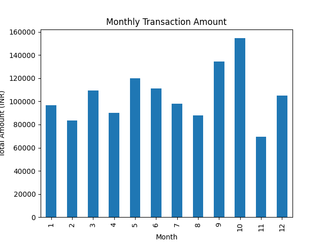
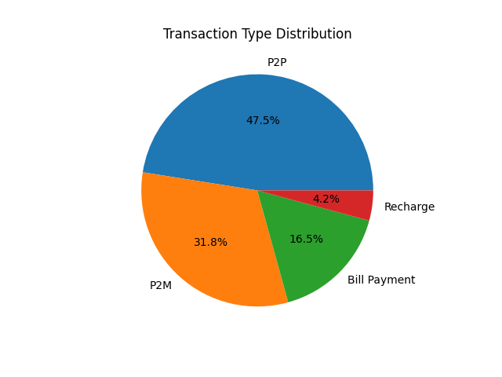

# Online Transaction Data Analysis (UPI 2024)

Developed by: Aman Raj

This project analyzes the UPI Transactions 2024 dataset to understand transaction trends and patterns.  
The project includes random sampling, data cleaning, preprocessing, and data visualization using Python.

---

## 📂 Project Steps

### 1️⃣ Random Sampling
- Selected 3,000 random records from 23,000 dataset  
- Ensured reproducibility using random_state  

### 2️⃣ Data Cleaning
- Removed duplicate records  
- Removed missing values  
- Converted timestamp to datetime format  
- Removed invalid (zero/negative) transaction amounts  
- Selected final 1,000 cleaned records  

### 3️⃣ Data Analysis & Visualization
- Calculated total transaction amount  
- Analyzed transaction type distribution  
- Generated monthly transaction trend  

---

## 📊 Visualizations

### Figure 1: Monthly Transaction Amount (Bar Graph)

### Figure 2: Transaction Type Distribution (Pie Chart)

---

## 🛠 Technologies Used
- Python  
- Pandas  
- Matplotlib  

---

## 📁 Files Included
- step1_random_sampling.py  
- step2_data_cleaning.py  
- step3_analysis.py  
- Figure_1_monthly_transaction_amount.png  
- Figure_2_transaction_type_distribution.png  

---

## 📌 Dataset Source
Kaggle – UPI Transaction Dataset 2024
